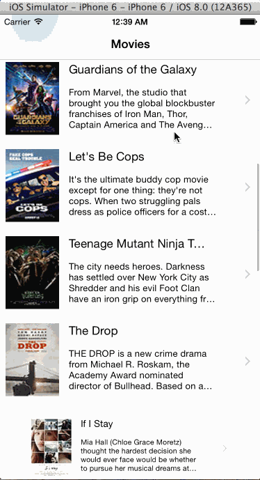

# RottenTomatoes IOS app

This is an IOS application written in Swift for displaying the latest box office movies using the [RottenTomatoes API](http://www.rottentomatoes.com/). 

Time spent: 10 hours spent in total

 * [x] User can view a list of movies from Rotten Tomatoes. Poster images must be loading asynchronously.
 * [x] User can view movie details by tapping on a cell
 * [ ] User sees loading state while waiting for movies API. 
 * [ ] User sees error message when there's a networking error. 
 * [x] User can pull to refresh the movie list

Notes: Spent most of the time on architecting and creating the model class and implement the delegate patten
 

Walkthrough of all user stories:

GIF created with [LiceCap](http://www.cockos.com/licecap/).

